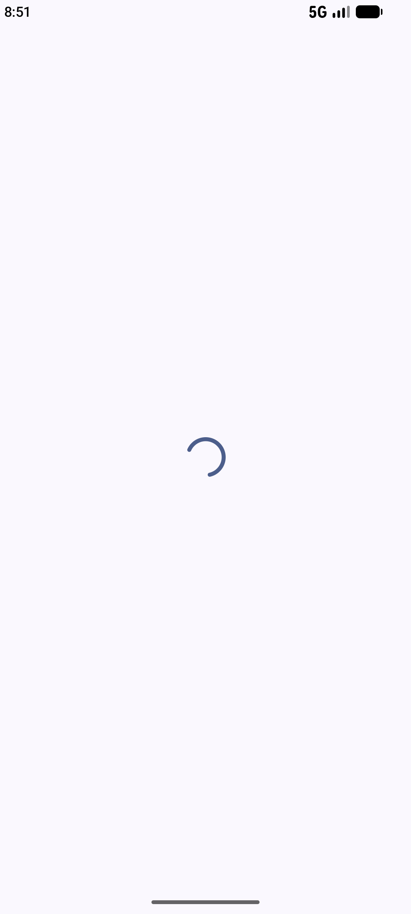
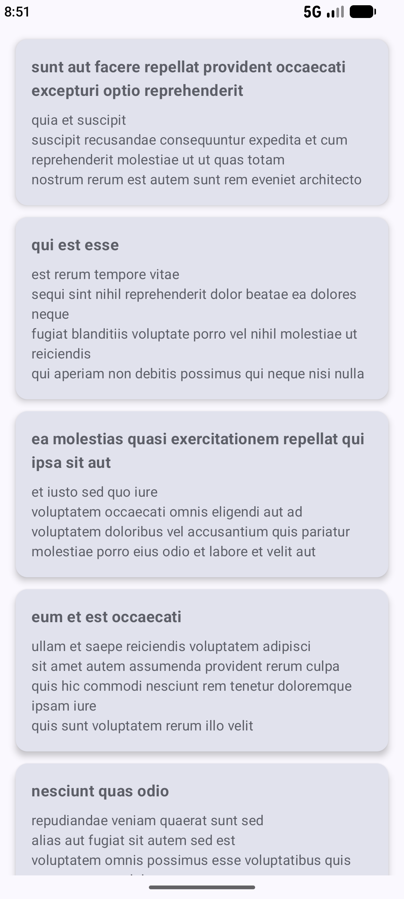
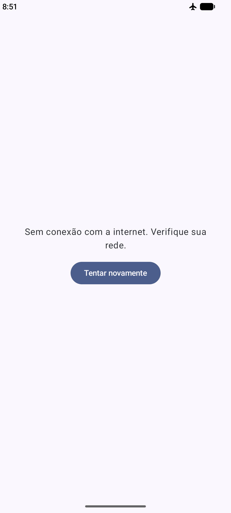

# Retrofit Radier

Aplicativo Android que consome a API pública [JSONPlaceholder](https://jsonplaceholder.typicode.com/posts) e exibe uma lista de posts, desenvolvido como exercício da disciplina **Programação para Dispositivos Móveis II** (Faculdade Matias Machline), a partir do material *"Dominando o Retrofit no Android: Consumo de APIs com Jetpack Compose e Flows"*.

## Screenshots

| Carregando | Lista de posts | Sem internet |
|:---:|:---:|:---:|
|  |  |  |

## Tecnologias

- **Kotlin** 2.2
- **Jetpack Compose** (Material 3)
- **Retrofit** 3.0 + **Gson** (conversão de JSON)
- **Coroutines** e **StateFlow**
- **ViewModel** (arquitetura MVVM)
- **Version Catalog** (`gradle/libs.versions.toml`)

## Estrutura do projeto

```
app/src/main/java/com/example/retrofit_radier/
├── network/
│   ├── Post.kt             # Entidade: modelo de dados do JSON
│   ├── ApiService.kt       # Serviço: endpoints da API (@GET)
│   └── RetrofitClient.kt   # Instância única (singleton) do Retrofit
├── PostUiState.kt          # Estados da tela: Loading, Success, Error
├── PostViewModel.kt        # Busca os dados e expõe o estado via StateFlow
└── MainActivity.kt         # Telas em Jetpack Compose
```

## Fluxo dos dados

```
API (JSON) → Retrofit + Gson → List<Post> → PostViewModel (StateFlow<PostUiState>) → Compose (collectAsState) → Tela
```

## Passo a passo do desenvolvimento

Cada etapa foi registrada em um commit separado:

1. **Projeto inicial**: criado com o template *Empty Activity* (Compose).
2. **Dependências**: Retrofit, conversor Gson e `lifecycle-viewmodel-compose` declarados no Version Catalog.
3. **Permissão de internet**: `android.permission.INTERNET` no `AndroidManifest.xml`.
4. **Camada de rede**:
   - `Post`: data class com `userId`, `id`, `title` e `body` (nomes iguais aos campos do JSON).
   - `ApiService`: interface com `@GET("posts") suspend fun getPosts()`.
   - `RetrofitClient`: `object` com a `BASE_URL` e o `GsonConverterFactory`, criado com `by lazy`.
5. **ViewModel**: `PostViewModel` faz a requisição dentro de `viewModelScope.launch` e publica o resultado em um `StateFlow`.
6. **Interface**: `LazyColumn` com um `Card` por post, observando o Flow com `collectAsState()`.
7. **Desafio: estados de Loading e Error**:
   - `PostUiState` (`sealed interface`) representa os três estados possíveis da tela.
   - Enquanto carrega, aparece um `CircularProgressIndicator`.
   - Em caso de falha, aparece uma mensagem de erro com o botão **Tentar novamente**. Falhas de rede (`IOException`) são tratadas separadamente das demais exceções.

## Como executar

1. Clone o repositório:
   ```bash
   git clone https://github.com/RadierFalk/retrofit-radier.git
   ```
2. Abra a pasta no **Android Studio** e aguarde o *Gradle Sync*.
3. Inicie um emulador (ou conecte um celular) e clique em **Run ▶**.

> O emulador precisa ter acesso à internet. Se aparecer a tela de erro logo após ligá-lo, aguarde a rede do emulador iniciar e toque em **Tentar novamente**.
